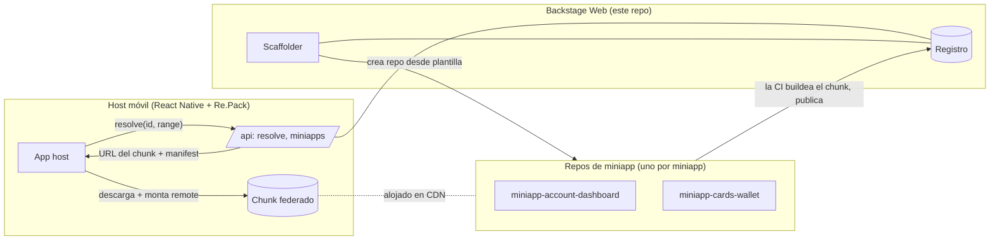
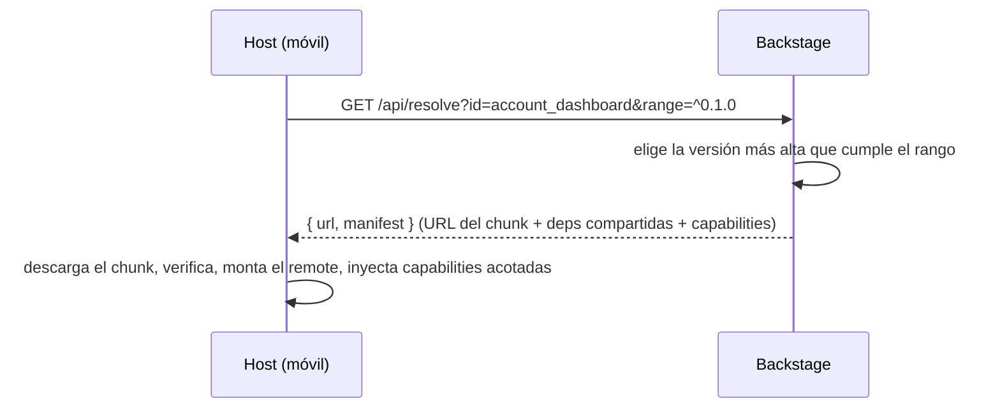

# Backstage Web — *Spotify para Miniapps*

> Plataforma para **crear, versionar y distribuir miniapps de React Native** que un host móvil carga bajo demanda vía **Module Federation**. Un "Spotify for Backstage": un catálogo donde cada miniapp es un remote construido y desplegado de forma independiente.

**🔗 Demo en vivo:** **[backstage-web-blond.vercel.app](https://backstage-web-blond.vercel.app)** · inicia sesión con GitHub
**🌐 English:** [README.md](./README.md)

<!-- 📸 Añade una captura del catálogo tras loguearte: docs/catalog.png -->
> 📸 *Capturas: tras iniciar sesión, coloca aquí `docs/catalog.png` y `docs/detail.png`.*

---

## Qué es

Una plataforma web en **Next.js** que actúa como plano de control de una flota de miniapps de React Native. Hace tres cosas:

| Capacidad | Qué significa |
|---|---|
| **Registro** | Fuente de verdad de cada miniapp: versiones, chunks publicados, manifest, owner, fecha de creación, URL del repo. |
| **Scaffolder** | "Crear miniapp" → genera un repo git nuevo desde una plantilla (cada miniapp es su propio repo). |
| **Distribución** | El host móvil pide *"dame `account_dashboard` compatible con `^0.1.0`"* y recibe la URL del chunk + manifest para descargar y montar en runtime. |

El único acoplamiento entre la web y el host móvil es un **contrato de tipos compartido y versionado** (`@org/miniapp-contract`). Todo lo demás está desacoplado.

## Arquitectura — tres planos



**Por qué importa:** cada equipo publica su miniapp de forma independiente (repo propio, CI propia, cadencia propia) mientras el host se mantiene delgado y las carga en runtime — sin recompilar el host para actualizar una miniapp.

## Características

- 🔐 **GitHub OAuth** (Auth.js v5) — toda la UI está protegida; el access token vive en el servidor y nunca se expone al navegador.
- 📇 **Catálogo + UI de detalle** — versiones, fecha de creación, link al repo, capabilities y un **badge de estado de CI** por miniapp.
- 🧱 **Dominio del registro** — lógica pura y totalmente testeada de resolución de versiones (versión exacta o compatibilidad por rango semver).
- 🏗️ **Scaffolder** — crea el repo de una miniapp desde una plantilla vía un `GitProvider` inyectable (GitHub REST).
- 🚦 **Estado de CI** — lee el último run de GitHub Actions por repo, con cache y un fallback resiliente a `unknown` (nunca rompe la UI).
- 🔌 **Todo inyectable** — GitProvider, ChunkStorage, RegistryStore y CiStatusProvider son interfaces, así que todo el sistema se verifica sin infra cloud real. **102 tests unitarios.**

## Cómo funciona la resolución



## Stack

**Next.js 16** (App Router) · **TypeScript** (strict) · **Auth.js v5** (GitHub) · **Vitest** + React Testing Library · **pnpm** · desplegado en **Vercel**. Storage de producción: Vercel Blob (chunks) + Upstash Redis (registro) — ver [`DEPLOY.md`](./DEPLOY.md).

## Ejecutar en local

```bash
pnpm install
pnpm dev      # http://localhost:3000
pnpm test     # 102 tests
```

Crea un `.env.local` para el auth (ignorado por git):

```bash
AUTH_SECRET=<openssl rand -base64 32>
AUTH_GITHUB_ID=<client id del OAuth App de GitHub>
AUTH_GITHUB_SECRET=<client secret del OAuth App de GitHub>
CI_STATUS_ENABLED=false   # los badges de CI salen "unknown" sin pegarle a GitHub
```

> Callback URL del OAuth App: `http://localhost:3000/api/auth/callback/github`.
> El deploy de la demo usa un store JSON commiteado (`data/registry.json`) para que el catálogo renderice sin provisionar servicios externos. Los endpoints de escritura (scaffold/publish/upload) necesitan KV + Blob + tokens — ver `DEPLOY.md`.

## API

| Endpoint | Propósito |
|---|---|
| `GET /api/resolve?id=&version=&range=` | El host resuelve qué montar → `{ id, version, url, manifest }` |
| `GET /api/miniapps` | Lista el catálogo |
| `POST /api/miniapps` | Registra una miniapp `{ id, name, owner }` |
| `POST /api/miniapps/:id/publish` | Publica una versión `{ version, url, manifest }` *(token)* |
| `POST /api/scaffold` | Crea el repo de una miniapp desde la plantilla *(token)* |

## Repos relacionados

| Repo | Rol |
|---|---|
| [backstagereactnative](https://github.com/DentVega/backstagereactnative) | El **host móvil** React Native + Re.Pack (+ memory-bank AI-DLC) |
| [miniapp-template](https://github.com/DentVega/miniapp-template) | **Plantilla** GitHub desde la que el scaffolder genera miniapps |
| [miniapp-account-dashboard](https://github.com/DentVega/miniapp-account-dashboard) | **Miniapp** de ejemplo (remote federado) |

---

<sub>Este es un **proyecto demo/portfolio** que muestra una arquitectura de micro-frontends para React Native (Module Federation vía Re.Pack) más un flujo de entrega asistido por IA. No es un producto bancario de producción.</sub>
