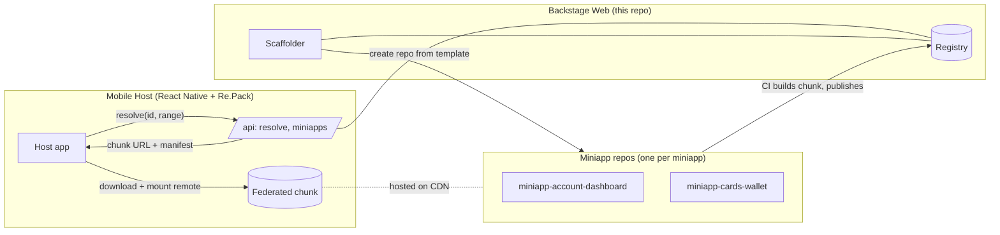
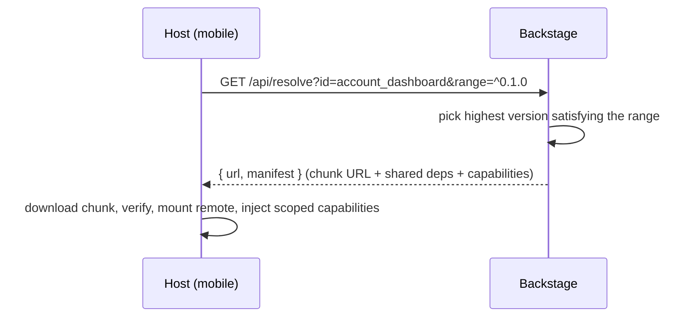

# Backstage Web — *Spotify for Miniapps*

> A platform to **create, version, and distribute React Native miniapps** that a mobile host loads on demand via **Module Federation**. Think "Spotify for Backstage": a catalog where each miniapp is an independently built, independently deployed remote.

**🔗 Live demo:** **[backstage-web-blond.vercel.app](https://backstage-web-blond.vercel.app)** · sign in with GitHub
**🌐 Español:** [README.es.md](./README.es.md)

<!-- 📸 Add a screenshot of the catalog once logged in: docs/catalog.png -->
> 📸 *Screenshots: after signing in, drop `docs/catalog.png` and `docs/detail.png` here.*

---

## What it is

A **Next.js** web platform that is the control plane for a fleet of React Native miniapps. It does three things:

| Capability | What it means |
|---|---|
| **Registry** | Source of truth for every miniapp: versions, published chunks, manifest, owner, creation date, repo URL. |
| **Scaffolder** | "Create miniapp" → generates a brand-new git repo from a template (each miniapp is its own repo). |
| **Distribution** | The mobile host asks *"give me `account_dashboard` compatible with `^0.1.0`"* and gets back a chunk URL + manifest to download and mount at runtime. |

The only coupling between the web platform and the mobile host is a **shared, versioned type contract** (`@org/miniapp-contract`). Everything else is decoupled.

## Architecture — three planes



**Why it matters:** teams ship miniapps independently (own repo, own CI, own release cadence) while the host stays thin and loads them at runtime — no host rebuild to update a miniapp.

## Features

- 🔐 **GitHub OAuth** (Auth.js v5) — the whole UI is gated; the access token stays server-side and is never exposed to the browser.
- 📇 **Catalog + detail UI** — versions, creation date, repo link, capabilities, and a **CI status badge** per miniapp.
- 🧱 **Registry domain** — pure, fully unit-tested version-resolution logic (exact version or semver-range compatibility).
- 🏗️ **Scaffolder** — creates a miniapp repo from a template via an injectable `GitProvider` (GitHub REST).
- 🚦 **CI status** — reads the latest GitHub Actions run per repo, cached, with a resilient `unknown` fallback (never breaks the UI).
- 🔌 **Everything injectable** — GitProvider, ChunkStorage, RegistryStore, CiStatusProvider are interfaces, so the whole system is verifiable without real cloud infra. **102 unit tests.**

## How resolution works



## Tech stack

**Next.js 16** (App Router) · **TypeScript** (strict) · **Auth.js v5** (GitHub) · **Vitest** + React Testing Library · **pnpm** · deployed on **Vercel**. Production storage: Vercel Blob (chunks) + Upstash Redis (registry) — see [`DEPLOY.md`](./DEPLOY.md).

## Run locally

```bash
pnpm install
pnpm dev      # http://localhost:3000
pnpm test     # 102 tests
```

Create a `.env.local` for auth (git-ignored):

```bash
AUTH_SECRET=<openssl rand -base64 32>
AUTH_GITHUB_ID=<GitHub OAuth App client id>
AUTH_GITHUB_SECRET=<GitHub OAuth App client secret>
CI_STATUS_ENABLED=false   # CI badges render "unknown" without hitting GitHub
```

> OAuth App callback URL: `http://localhost:3000/api/auth/callback/github`.
> The demo deploy uses a committed JSON store (`data/registry.json`) so the catalog renders without provisioning any external service. Write endpoints (scaffold/publish/upload) need KV + Blob + tokens — see `DEPLOY.md`.

## API

| Endpoint | Purpose |
|---|---|
| `GET /api/resolve?id=&version=&range=` | Host resolves what to mount → `{ id, version, url, manifest }` |
| `GET /api/miniapps` | List the catalog |
| `POST /api/miniapps` | Register a miniapp `{ id, name, owner }` |
| `POST /api/miniapps/:id/publish` | Publish a version `{ version, url, manifest }` *(token)* |
| `POST /api/scaffold` | Create a miniapp repo from the template *(token)* |

## Related repos

| Repo | Role |
|---|---|
| [backstagereactnative](https://github.com/DentVega/backstagereactnative) | The React Native + Re.Pack **mobile host** (+ AI-DLC memory-bank) |
| [miniapp-template](https://github.com/DentVega/miniapp-template) | GitHub **template** the scaffolder generates miniapps from |
| [miniapp-account-dashboard](https://github.com/DentVega/miniapp-account-dashboard) | Example **miniapp** (federated remote) |

---

<sub>This is a **portfolio/demo project** showcasing a micro-frontend architecture for React Native (Module Federation via Re.Pack) plus an AI-assisted delivery workflow. Not a production banking product.</sub>
